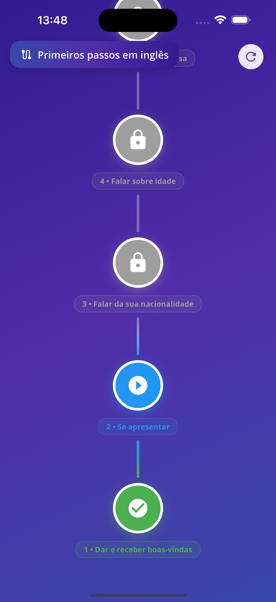

# Mini Fluency

Uma aplicação Flutter demonstrando uma trilha de aprendizado de idiomas com lições e tarefas, construída com Clean Architecture e padrão BLoC.

## � Screenshots

<div align="center">
  
  
</div>

## �📱 Funcionalidades

- Visualização interativa da trilha de aprendizado
- Rastreamento de progresso das lições
- Sistema de conclusão de tarefas
- Funcionalidade de reset de lições
- Progresso persistente com armazenamento local
- Animações e transições suaves

## 🚀 Como Rodar o Projeto

### Pré-requisitos

- Flutter SDK 3.35.5 ou superior
- Dart 3.0 ou superior

### Instalação

1. Clone o repositório:
```bash
git clone <repository-url>
cd mini_fluency
```

2. Instale as dependências:
```bash
flutter pub get
```

3. Execute o aplicativo:
```bash
flutter run
```

### Executando os Testes

Executar todos os testes:
```bash
flutter test
```

Executar testes com cobertura:
```bash
flutter test --coverage
```

Visualizar relatório de cobertura (requer lcov):
```bash
lcov --summary coverage/lcov.info
```

Cobertura atual de testes: **69.5%** (362/521 linhas)

## 🏗️ Arquitetura

### Clean Architecture

Este projeto implementa **Clean Architecture** para demonstrar uma solução robusta, escalável e de fácil manutenção. Embora possa ser considerada verbosa para um projeto deste tamanho, a arquitetura foi escolhida para demonstrar boas práticas e separação de responsabilidades.

**Camadas:**
- **Camada de Domínio**: Lógica de negócio e entidades (independente de frameworks)
- **Camada de Dados**: Fontes de dados, DTOs e implementações de repositórios
- **Camada de Apresentação**: Componentes de UI e gerenciamento de estado (BLoC/Cubit)

**Benefícios:**
- ✅ Separação clara de responsabilidades
- ✅ Altamente testável (69.5% de cobertura)
- ✅ Fácil de manter e expandir
- ✅ Lógica de negócio independente de framework
- ✅ Facilita colaboração em equipe

### Gerenciamento de Estado: BLoC (Cubit)

**Por que BLoC?**

BLoC foi escolhido por sua:
- **Previsibilidade**: Fluxo unidirecional de dados facilita rastreamento de mudanças de estado
- **Testabilidade**: Lógica de negócio separada da UI permite testes abrangentes
- **Escalabilidade**: Padrão comprovado para aplicações de grande escala
- **Comunidade**: Forte ecossistema e documentação

## 📂 Estrutura do Projeto

```
lib/
├── app/
│   ├── data_layer/          # Fontes de dados, DTOs, repositórios
│   │   ├── data_sources/
│   │   ├── dtos/
│   │   └── repositories/
│   ├── domain_layer/        # Lógica de negócio, entidades, casos de uso
│   │   ├── entities/
│   │   ├── use_cases/
│   │   └── abstract_repositories/
│   ├── infra/               # Infraestrutura (tema, config, componentes)
│   │   ├── components/
│   │   ├── config/
│   │   └── core/
│   └── presentation_layer/  # UI, gerenciamento de estado (Cubits)
│       ├── path/
│       ├── lesson/
│       └── splash/
└── main.dart
```

## 🔧 Decisões Técnicas

### Gerenciamento de Dados JSON

**Implementação Atual:**
O aplicativo carrega e salva todo o JSON da trilha com todas as lições e tarefas em uma única operação.

**Por que essa abordagem?**
- Simplifica a funcionalidade offline-first
- Reduz número de operações de I/O
- Adequado para conjuntos de dados pequenos a médios

**Em uma aplicação real:**
As chamadas seriam separadas:
- `GET /paths/{id}` - Carregar metadados da trilha
- `GET /paths/{id}/lessons` - Carregar lista de lições
- `GET /lessons/{id}/tasks` - Carregar tarefas de uma lição específica
- `PATCH /tasks/{id}` - Atualizar conclusão de tarefa individual

Essa separação permitiria:
- Melhorar tempo de carregamento inicial
- Reduzir uso de banda
- Habilitar sincronização em tempo real
- Suportar paginação para grandes conjuntos de dados
- Permitir invalidação granular de cache

### Armazenamento Local

Utiliza SharedPreferences para:
- Cache de dados da trilha
- Persistência do progresso do usuário
- Experiência offline-first

### Simulação de Erros

O projeto inclui uma **simulação de erros aleatórios** no `PathCubit` para demonstrar tratamento robusto de falhas.

**Implementação:**
- Usa um gerador `Random` injetável via construtor
- ~30% de chance de simular um erro ao carregar dados
- Completamente testável com `FakeRandom` nos testes

**Por que isso?**
- Demonstra tratamento de erros em condições adversas
- Valida que a UI responde corretamente a falhas
- Permite testar fluxos de erro de forma determinística

> **Nota**: Em produção, essa simulação seria removida e substituída por tratamento real de erros de rede/API.

### Estratégia de Testes

**Cobertura: 69.5%** (362/521 linhas)

**Tipos de Testes:**
- **Testes Unitários** (56): Cubits, Casos de Uso, Repositórios, DTOs, Entidades
- **Testes de Widget** (23): Componentes UI (PrimaryButton, LessonNode, LessonConnector)

**Padrões de Teste Utilizados:**
- `mocktail` para mock de dependências
- `bloc_test` para testar estados do Cubit
- `Random` injetável para testes determinísticos de simulação de erros
- Testes de widget com `flutter_test`

**O que é Testado:**
- ✅ Lógica de negócio (PathCubit, Use Cases)
- ✅ Transformações de dados (DTOs)
- ✅ Implementações de repositórios
- ✅ Renderização e interações de componentes UI
- ✅ Tratamento de erros e casos extremos

## 📦 Dependências

**Principais:**
- `flutter_bloc ^9.1.1` - Gerenciamento de estado
- `shared_preferences ^2.0.0` - Armazenamento local
- `modular_interfaces ^2.0.0` - Injeção de dependências

**Dev:**
- `flutter_test` - Framework de testes
- `mocktail ^1.0.4` - Biblioteca de mocks
- `bloc_test ^10.0.0` - Utilitários para testes BLoC

## 🎯 Próximos Passos

Com mais tempo, as seguintes melhorias seriam implementadas no protótipo:

### Testes e Qualidade
- [ ] **Aumentar Cobertura de Testes**: Atingir 90%+ de cobertura, incluindo testes para LessonPage e outros componentes

### Funcionalidades da UI
- [ ] **Implementar Tipos de Tarefas**: Criar interfaces para os diferentes tipos (flashcard, múltipla escolha, ordenar palavras, etc.)
- [ ] **Feedback Visual Aprimorado**: Adicionar animações de sucesso/erro ao completar tarefas
- [ ] **Modo Escuro**: Implementar tema escuro completo com transição suave

### Arquitetura e Código
- [ ] **Separação de Responsabilidades**: Extrair lógica de cores e ícones do widget para classes auxiliares

### Performance e UX
- [ ] **Skeleton Loading**: Adicionar estados de loading mais elegantes

## 📄 Licença

Este projeto é uma peça de demonstração/portfólio.

---

**Nota**: Este é um projeto de demonstração apresentando Clean Architecture, padrão BLoC e testes abrangentes em Flutter. As escolhas de arquitetura refletem boas práticas para aplicações de grande escala, mesmo que o escopo atual seja limitado.
